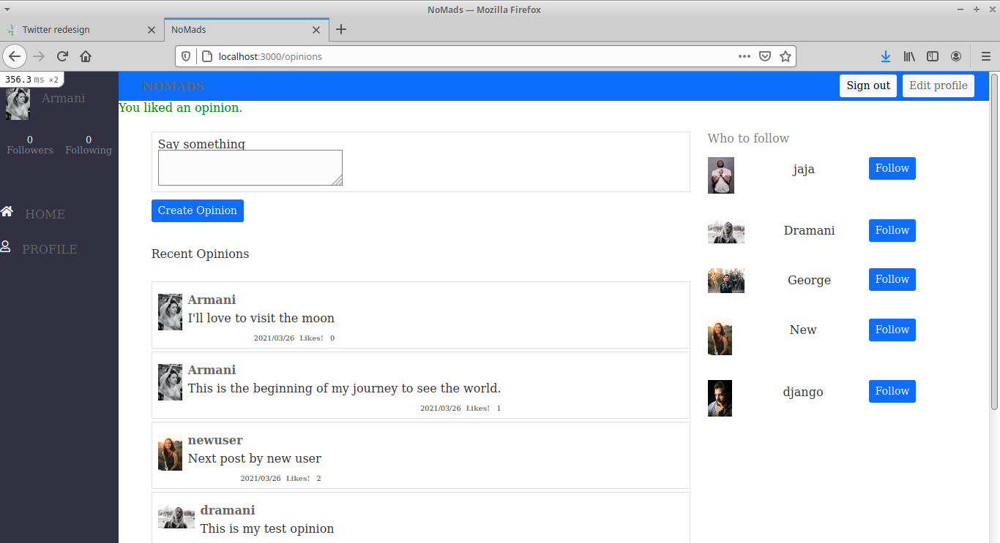
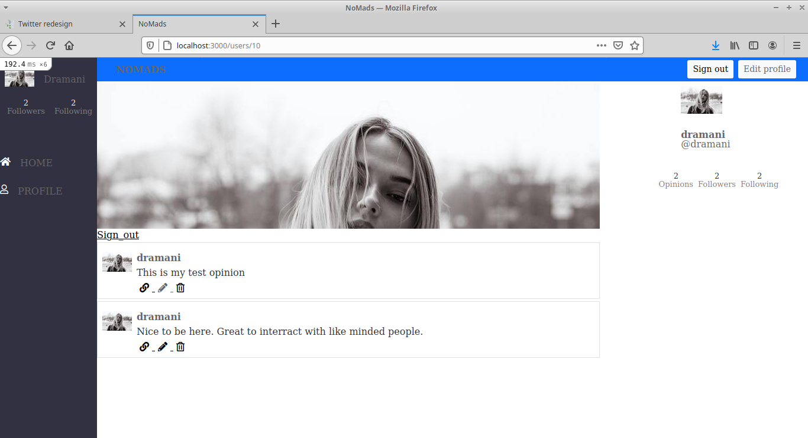

# README

# NOMADS

## Project Description
> NOMAD is a social media web application intended as a destination for digital nomads to share their opinion and travel experiences.

> The application represents an MVP of the product with the full graphical design but only basic features that would be extended in the future.




## Built With

- ruby '3.0.0'
- Ruby on Rails v6.1.3'

## Tools and gems

- Devise
- Bootstrap
- rspec
- capybara
- rubocop
- Active storage

## Live Demo
[Deployed app](https://evening-wave-65441.herokuapp.com/)

## Getting Started

To get a local copy up and running follow these simple example steps.

### Prerequisites

- Ruby: 3.0.0
- Rails: 6.1.3
- PostgreSQL. Versions 9.3 and up are supported

### Set Up

- Go to the "Code" section of this repository and press the green button that says "Code". Copy the URL or the SSH key.
- Go to the terminal and enter:
```
git clone URL/SSH key
```
- If you don't have git, you can download this project and unzip it.
- Change directory into the folder the application is saved.
- To install the gems, run:
```
bundle install
```
- Install yarn (you need to have npm installed) by running:

```
npm install --global yarn
```

Setup database with:

```
   rails db:create
   rails db:migrate
```

Start server with:

```
    rails server
```

Open `http://localhost:3000/` in your browser.

- Sign up with your full name, username and password.

- You can edit your profile by uploading a profile photo that shows up on your home page. 

- You can also edit your profile to upload a cover picture that is displayed on your personal page.

- To share your experience, create an opinion on the home page.

- You can see suggestions about who to follow on the right panel of the page with a follow button in front of each suggestions. Click "follow" to follow a user. 

- The Followers and following count helps you keep track of your followers to know who unfollowed or started following you as well as other users you follow. 

- You can engage with other users by liking their opinions and vice versa.


### Run tests

```
    rpsec --format documentation
```


### Deployment

- Deployed on Heroku

## Author


👤 **George Gbenle**

- GitHub: [george-shammar](https://github.com/george-shammar)
- Twitter: [@GeorgeShammar](https://twitter.com/GeorgeShammar)
- LinkedIn: [George Gbenle](https://www.linkedin.com/in/georgegbenle/)


## 🤝 Contributing

Contributions, issues and feature requests are welcome!


## Show your support

Give a ⭐️ if you like this project!


## 📝 License

This project is [MIT](LICENSE) licensed.

## Acknowledgments

Design idea by [Gregoire Vella on Behance](https://www.behance.net/gregoirevella)

